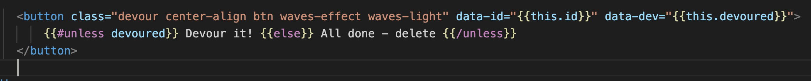
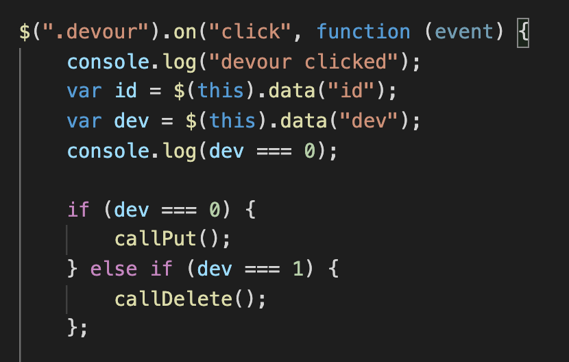

# Sushi Lover

### [Deployed](https://nameless-bastion-18794.herokuapp.com/) Link

 Final Product Preview
 

    

  
## Summary & Process
For this assignment, our objective was to create an app that allows the user to add a food (sushi) order to the page and then provide the chance for the user to "devour" it which would then move the order into a second column. 

I started this project by initializing my file structure (MVC) and data base (mySQL). From there I created API routes that incorporate into handlebar layouts. Only once all operations were functional did I concern myself with the layout and styling of client side page itself (Materialize).

A highlight of this project include the addition of a delete button with it's associated functionality (shown below).

## Table of Contents

* [Take Aways](#take_aways)

* [Technologies Used](#technologies_used)

* [Contact](#contact)

## Code Highlight

By using data-attributes, the handlebar #each function, and a conditional statement, I was able to dynamically generate buttons that not only change text but also change functionality after being clicked. 

When the button is associated with an order that has not been "devoured", the click function pushes that item to the second list. If the item is in the "devoured" list, that same button will now act as a delete button.
______________

Data Attribute:

    

Same class / different API call based on conditional:

    

## Take_Aways
MVC works really well to compartmentalize file structures. However, it requires a strong understanding of many moving parts that can take some time to fully understand.

## Technologies_Used

- mySQL / MVC structure
- Node.js / Javascript / ES6 
- NPM / Express / HandleBars
- Visual Studio Code
- Git / GitHub / Heroku

## Contact

* [Colin Whitcomb](https://github.com/Colin-Whitcomb)
* [LinkedIn](https://www.linkedin.com/in/colin-whitcomb-b808301a6/)
* [Portfolio](https://colin-whitcomb.github.io/React_Portfolio/)